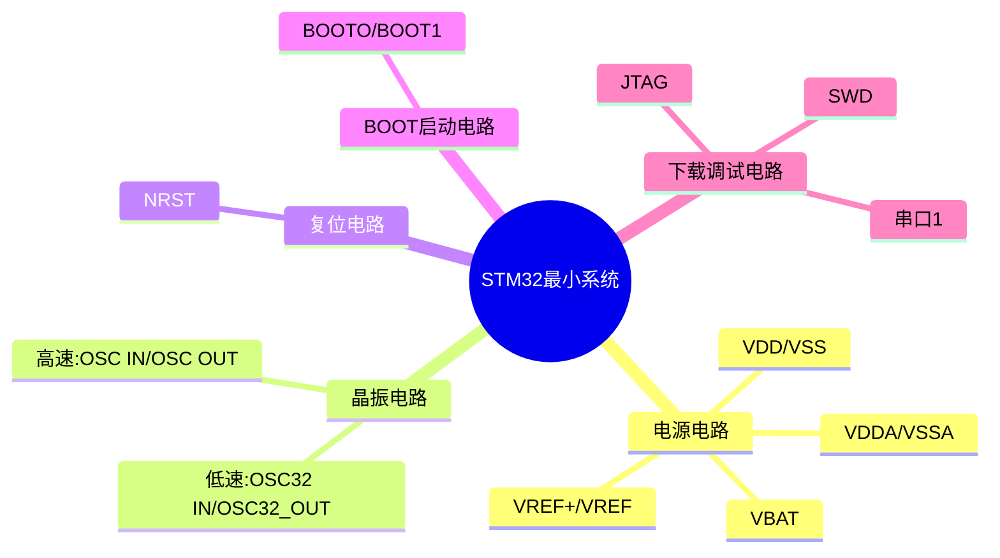

本章的**核心大纲**：
1. **7.1 嵌入式最小系统概述**：定义与组成模块。
2. **7.2 STM32嵌入式微控制器详解**：
    - 芯片选型与命名规则（以STM32F407为例）。
        
    - 内部架构：电源系统、时钟系统、复位系统、调试接口。
        
3. **7.3 最小系统硬件电路设计**：时钟、复位、LED、下载口、电源、启动模式电路的具体设计原理。
4. **7.4 实验电路板介绍**：原理图与外设布局。
5. **7.5 通信接口协议**：I2C、SPI、RS232、RS485及串行通信协议设计。
6. **7.6 开发环境搭建**：Keil MDK与STM32CubeMX的配合使用。
7. **7.7 基础功能配置实战**：RTC、中断、定时器、看门狗及功耗计算。

# 7.1 最小系统概念与STM32芯片基础

**定义**：**嵌入式最小系统**指能使处理器运行的**最小化模块配置** 。它以处理器为中心，配合外围电路，构成一个最基础的、能工作的系统。

**核心组成**：
- **电源电路**：提供系统运行所需的电压（如3.3V）。
- **时钟电路**：提供处理器和外设工作的“心跳”时钟信号 。
- **复位电路**：提供复位信号，让系统在异常或上电时回到初始状态 。
- **下载/调试电路**：用于对处理器进行编程和程序下载 。
- **存储电路**：存储程序和数据（现代MCU如STM32通常片上自带Flash和SRAM）。

STM32微控制器选型与命名规则：
[[ES_CHAP07_嵌入式最小系统构建.pdf#page=4|ES_CHAP07_嵌入式最小系统构建, p.4]]
![[STM32微控制器选型与命名规则.png]]

芯片引脚与内部系统架构
关键引脚需要注意 ：
- **电源引脚**：VDD/VSS (数字电源/地)，VDDA/VSSA (模拟电源/地) 。
- **复位引脚**：NRST 。
- **启动选择**：BOOT0, BOOT1 。
- **晶振引脚**：OSC_IN/OUT (高速)，OSC32_IN/OUT (低速) 。

# 7.2 STM32嵌入式微控制器

## 时钟系统：芯片的“心脏

STM32需要根据不同的外设（如 USB、以太网、低速串口）分配不同的频率，以达到高性能和低功耗的平衡。
**A. 四大时钟源（Source）** STM32 有两个“内部”源（便宜、精度低）和两个“外部”源（需要外接晶振、精度高）：

1. **HSI (High Speed Internal)**：内部高速时钟，约 16MHz。芯片上电默认先用它，启动快，但精度不够高 。
2. **HSE (High Speed External)**：外部高速时钟。通常外接 **4~26MHz** 的晶振（开发板常用 8MHz 或 25MHz）。这是系统运行的主力，精度高 。
3. **LSI (Low Speed Internal)**：内部低速时钟，约 32kHz。主要给独立看门狗 (IWDG) 使用 。
4. **LSE (Low Speed External)**：外部低速时钟。外接 **32.768kHz** 晶振。专门给 **RTC (实时时钟)** 使用，保证断电后时间走得准 。

**B. 核心机制：PLL (锁相环倍频)**
外部晶振通常只有 8MHz 或 25MHz，怎么让芯片跑到 168MHz 的高性能？全靠 PLL (Phase Locked Loop)。

- 计算公式：课件中给出了一个典型例子（假设外部输入 HSE 为 8MHz）：
    $$PLLCLK = HSE \times \frac{N}{M \times P} = 8\text{MHz} \times \frac{336}{8 \times 2} = 168\text{MHz}$$
    - 先分频 (/M)，再倍频 (xN)，再分频 (/P) 6。

**C. 时钟树与总线频率（重要考点）** SYSCLK (系统时钟) 产生后，会经过分频分给不同的总线。STM32F407 内部有三条主要总线，它们的速度上限不同：
- **AHB 总线 (HCLK)**：连接内核、内存、DMA。最高 **168MHz**。
- **APB2 总线 (PCLK2)**：连接高速外设（如 UART1, SPI1, TIM1, GPIO）。最高 **84MHz**。
- **APB1 总线 (PCLK1)**：连接低速外设（如 UART2, I2C, DAC）。最高 **42MHz**。

## 复位系统：系统的“急救包”
当系统跑飞、死机或刚上电时，需要复位。

- **三种复位类型**：系统复位、电源复位、备份域复位 。
    
- **NRST 引脚**：这是芯片的复位输入脚。
    
- **复位条件**：NRST 引脚检测到 **低电平**，且持续时间至少 **20µs**，芯片就会复位 。

## 调试系统：JTAG vs SWD

将程序烧录到芯片并进行断点调试的接口。STM32 支持两种协议：

- **JTAG (Joint Test Action Group)**：
    - 国际标准协议。
        
    - 缺点：占用引脚多（5个引脚：TDI, TDO, TMS, TCK, TRST），占用板子空间大 。
        
- **SWD (Serial Wire Debug)**：
    - ARM 专门设计的调试协议。
        
    - 优点：**强烈推荐**。只需要 **2个引脚** (SWCLK, SWDIO) 加上电源和地即可完成仿真和下载。既节省了 IO 口资源，布线也简单 。

# 7.3 基于 STM32F407 的最小系统构建

1. 电源电路设计
2. 时钟/晶振电路设计
3. 复位电路设计
4. 启动模式匹配（BOOT）
5. 下载电路（SWD）

# 7.5 通信接口详解

## 1. I2C 总线 (Inter-Integrated Circuit)

I2C 是一种非常节省引脚的通信方式，常用于连接板上的低速外设（如 EEPROM、传感器）。

- **硬件特点** ：
    
    - **两根线**：SCL (时钟线) 和 SDA (数据线)。
        
    - **主从结构**：由主设备（MCU）发起，从设备响应。
        
    - **同步半双工**：共用一根数据线，同一时刻只能收或发。
        
- **时序关键点** ：
    
    - **空闲状态**：SCL 和 SDA 均由上拉电阻拉为高电平。
        
    - **起始信号 (Start)**：SCL 为高时，SDA 由高变低。
        
    - **停止信号 (Stop)**：SCL 为高时，SDA 由低变高。
        
    - **数据有效性**：SCL 为高电平时读取数据，SCL 为低电平时改变数据。
        
- **协议逻辑** ：
    
    - **设备地址**：每次通信先发 7 位地址 + 1 位读写位（R/W）。
        
    - **R/W位**：`0` 表示写（主→从），`1` 表示读（从→主）。
        
    - **应答 (ACK)**：接收方每收到一个字节，必须拉低 SDA 一位时间作为应答。

## 2. SPI 总线 (Serial Peripheral Interface)

SPI 比 I2C 更快，适合对速度有要求的场合（如 Flash 存储、以太网模块、彩屏）。

- **硬件特点** ：
    
    - **全双工**：收发同时进行，速度快。
        
    - **四根线**：
        
        1. **SCK**：时钟线。
            
        2. **MOSI**：Master Output Slave Input（主机发从机收）。
            
        3. **MISO**：Master Input Slave Output（主机收从机发）。
            
        4. **CS/SS**：片选线（通信时拉低选中从机）。

## 3. 串行通信：UART, RS232 与 RS485

A. 硬件接口标准对比

|**特性**|**RS232**|**RS485**|
|---|---|---|
|**通信方式**|3线全双工 (TX, RX, GND)|2线半双工 (A, B)|
|**传输模式**|非平衡（单端信号）|**差分平衡传输** (抗干扰能力极强)|
|**逻辑 1**|**-3V ~ -15V** (负逻辑)|**+200mV ~ +2500mV** (差分电压)|
|**逻辑 0**|**+3V ~ +15V** (负逻辑)|**-200mV ~ -2500mV** (差分电压)|
|**电平转换芯片**|MAX232 / SP3232|MAX485 / SP3485|
|**应用场景**|电脑串口调试、短距离点对点|工业现场长距离、多点组网通信|
STM32 芯片引脚输出的是 **TTL 电平** (0V/3.3V)，不能直接接 RS232 或 RS485，必须加上述的电平转换芯片 。

B. 软件通信协议设计
- **文本协议（首尾标志法）** ：
    
    - **例子**：GPS 的 NMEA-0183 协议。
        
    - **格式**：`$GPGGA, 数据..., *校验码`
        
    - **特点**：以 `$` 开头，以 `\r\n` (回车换行) 结尾。直观，人眼可读，但效率较低。
        
- **定长/变长二进制协议** ：
    
    - **格式**：`报文头(0xAA) + 长度(Len) + 数据(Data) + 校验和(Sum)`。
        
    - **解析逻辑**：收到 `0xAA` 知道开始 -> 读下一位知道长度 -> 读够数据 -> 算校验和对比。
        
    - **特点**：效率高，适合单片机之间通信。
        
- **工业标准协议 (Modbus RTU)** ：
    
    - **格式**：`地址 + 功能码 + 数据 + CRC校验`。
        
    - **例子**：读取寄存器指令 `01 03 00 00 00 01 84 0A`。
        
    - **特点**：工业界的通用语言，可靠性高，但CRC计算相对复杂。

