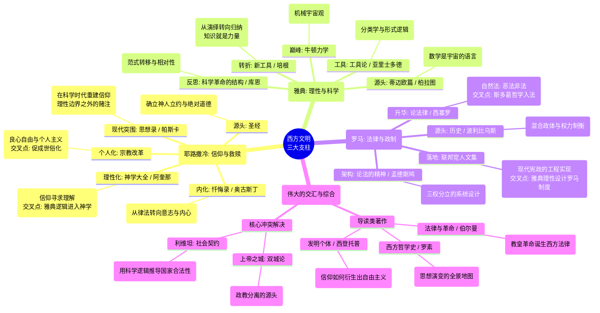

# 西方文明基因测序：阅读计划

## 阶段一：绘制地图（总览期）

目标： 在进入细节森林之前，先拿到全景地图，建立基本的历史坐标系。

耗时： 约 1 个月

- **核心书目：** 《西方哲学史》（伯特兰·罗素）
    
    - **阅读策略：** 不需要逐字死磕。重点关注罗素对“希腊文明兴起”、“天主教哲学”和“近代逻辑分析”的评价。
        
    - **辅助书目：** 《发明个体：西方的起源》（拉里·西登托普）
        
    - **思考题：** 为什么罗素认为“不确定性”是哲学的核心？西登托普如何论证“自由主义是基督教的私生子”？
        

## 阶段二：溯源之旅（古典期）

目标： 回到三大支柱的源头，理解它们最纯粹的样子。

耗时： 约 2-3 个月

### 1. 耶路撒冷（信仰的内核）

- **书目：** 《圣经·新约》（重点：《罗马书》、《约翰福音》）
    
- **书目：** 《忏悔录》（奥古斯丁）
    
- **关注点：** 留意“罪”、“恩典”和“自由意志”这三个概念是如何被定义的。
    

### 2. 雅典（理性的觉醒）

- **书目：** 《蒂迈欧篇》（柏拉图 - 选读关于宇宙几何构造的章节）
    
- **书目：** 《工具论》或《形而上学》（亚里士多德 - 选读第一卷）
    
- **关注点：** 希腊人是如何摆脱神话，开始用“定义”和“推演”来解释世界的？
    

### 3. 罗马（权力的驯化）

- **书目：** 《历史》（波利比乌斯 - 选读第六卷：论罗马政体）
    
- **书目：** 《论法律》（西塞罗）
    
- **关注点：** 罗马人如何发现“混合政体”的稳定性？什么是“自然法”？
    

## 阶段三：冲突与重构（近代转折期）

目标： 观察三大支柱如何在近代发生剧变，并彼此剧烈碰撞。

耗时： 约 3 个月

### 1. 信仰的突围

- **书目：** 《思想录》（帕斯卡）
    
- **场景：** 科学已经解释了宇宙，信仰不再是理所当然的。帕斯卡如何在理性的悬崖边为信仰辩护？
    

### 2. 科学的革命

- **书目：** 《新工具》（弗朗西斯·培根）
    
- **场景：** 亚里士多德的逻辑被抛弃，实验和征服自然成为新目标。
    

### 3. 政治的工程学

- **书目：** 《利维坦》（霍布斯）或《君主论》（马基雅维利）
    
- **书目：** 《论法的精神》（孟德斯鸠）
    
- **场景：** 政治不再依赖美德或神权，而是变成了精密的利益计算和权力制衡设计。
    

## 阶段四：现代的回响（应用与反思）

目标： 理解这些古老的思想如何塑造了当下的世界规则。

耗时： 长期

- **政治落地：** 《联邦党人文集》（汉密尔顿等）——看罗马的理想如何变成美国的宪法。
    
- **信仰辩护：** 《返璞归真》（C.S. 路易斯）——看古老的信仰如何回应现代人的道德困境。
    
- **科学反思：** 《科学革命的结构》（库恩）——看科学是如何不断打破自身范式的。
    
- **制度深析：** 《法律与革命》（伯尔曼）——看宗教如何塑造了法律传统。
    

## 阅读建议

1. “十字交叉法”：
    
    不要孤立地读。读《联邦党人文集》时，回想一下波利比乌斯的《历史》；读帕斯卡时，回想一下奥古斯丁。寻找思想的“回声”。
    
2. 关注“关键词”的变迁：
    
    追踪几个核心词汇在不同书中的定义变化：“理性” (Reason)、“自然” (Nature)、“自由” (Liberty)。这三个词在希腊、罗马和基督教语境下意思完全不同。
    
3. 保持耐心：
    
    这些书每一本都塑造了几个世纪的历史。如果读不懂，是正常的。回到《西方哲学史》查阅背景，或者寻找该书的导读材料。